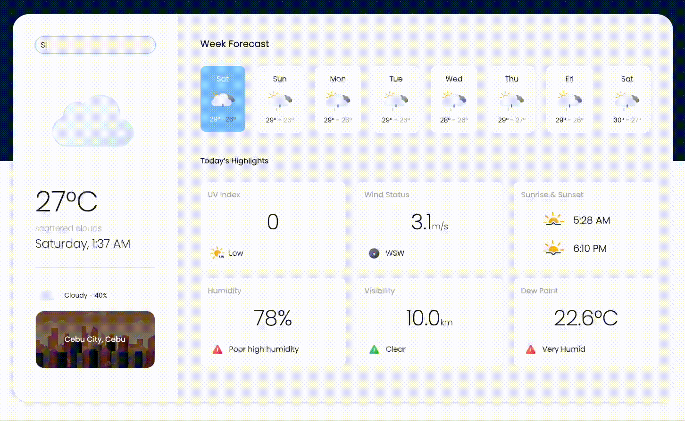
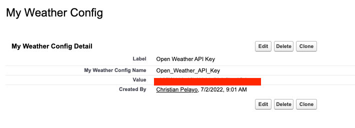
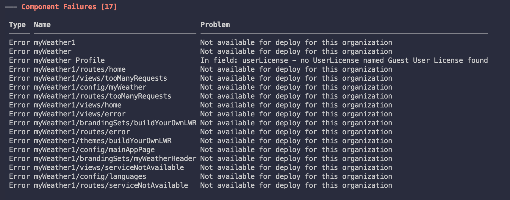

# Weather Dashboard on SF Experience Cloud
  [](https://codecov.io/gh/pelayochristian/my-weather-app)

## Introduction
Created as a side project, intends to learn integration in Salesforce Platform by building a Weather Dashboard app that consumes web-service from OpenWeather API. This app is built on top of the Salesforce Experience Cloud (Community Page) using LWR Template. 

Tech Stack:
- [x] LWC
- [x] Apex



## Pre-Deployment Steps
### [Create New Digital Experience](https://app.tango.us/app/workflow/e6c7a07d-3e59-4ed5-9664-2e853dde4822?utm_source=markdown&utm_medium=markdown&utm_campaign=workflow%20export%20links)

***

#### 1. If your org is not Experience Bundle Enable, then go to setup and type in the quick box 'Digital Experience', checked the Enable Digital Experience and provide your prefer Domain Name.


#### 2. On the Setup go to All Sites and Click on new to create site


#### 3. Click on Build Your Own (LWR)…


#### 4. Click on Get Started


#### 5. Provide Name and URL, select Unauthenticated then create.


***


## Deploy the repository

1. Clone the my-weather-app repository:
```
git clone https://github.com/pelayochristian/my-weather-app.git
cd my-weather-app
```
2. Authorize the project in your dev org and provide it with and alias (**mydevorg** in the command below):
```
sfdx auth:web:login -d -a mydevorg
```
3. Deploy the project by providing the authorize user from above (**mydevorg**):
```
sfdx force:source:deploy -p force-app -u mydevorg
```

## OpenWeather API Key
API Key of the OpenWeather is stored in custom metadata that can be modify in the screenshot below:


## Sample Apex Integration
On this method, named credentials is used to get the weather forecast from the OpenWeatherAPI.
```java

private static final String OW_CURRENT_WEATHER_API = 'data/2.5/onecall?exclude=hourly,minutely,alerts';
private static final Integer DEFAULT_LATITUDE = 13;
private static final Integer DEFAULT_LONGITUDE = 122;
private static final String UNIT_METRIC = 'METRIC';

public static MW_OpenWeatherOneCall getWeatherForecast(Decimal longitude, Decimal latitude, String unitType) {
    MW_OpenWeatherOneCall weatherForecast = null;
    try {
        longitude = longitude == null ? DEFAULT_LONGITUDE : longitude;
        latitude = latitude == null ? DEFAULT_LATITUDE : latitude;
        unitType = unitType == null ? UNIT_METRIC : unitType;
        String endPoint = 'callout:Open_Weather_Service/' 
            + OW_CURRENT_WEATHER_API + '&lat=' + latitude + '&lon=' 
            + longitude + '&units=' + unitType + '&appId=' 
            + MW_UtilHelper.getOpenWeatherAPIKey();
        

        Http http = new Http();
        HttpRequest httpRequest = new HttpRequest();
        httpRequest.setEndpoint(endPoint);
        httpRequest.setMethod('GET');
        HttpResponse httpResponse = http.send(httpRequest);
        if (httpResponse.getStatusCode() == 200) {
            // Replace rain 1h attribute to oneHour
            String responseBody = httpResponse.getBody()
                .replace('1h', 'oneHour');
            weatherForecast = MW_OpenWeatherOneCall.parse(responseBody);
        }
    } catch (Exception ex) {
        System.debug(
                'Error : MW_OpenWeatherOneCallService.getWeatherForecast() with message ' +
                ex.getMessage()
        );
    }
    return weatherForecast;
}
```

## Possible Error on Deployment

For this error, make sure that the target org has a Experience Bundle Enable. Make sure to follow the pre-deployment steps for enabling the Experience Cloud.
